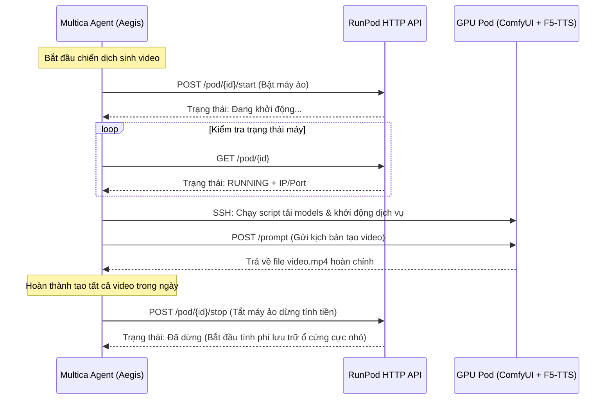

# Phương án B: Thuê GPU Cloud theo giờ & Điều khiển tự động bằng AI Agent

Tài liệu này chi tiết hóa phương án sử dụng dịch vụ GPU Cloud linh hoạt theo giờ và cách thiết lập AI Agent để tự động hóa cấu hình, bật/tắt máy chủ nhằm tối ưu hóa chi phí vận hành.

---

## I. Các Dịch vụ GPU Cloud đáp ứng tốt nhất

Để triển khai phương án này, chúng ta cần các nhà cung cấp GPU hỗ trợ **API mạnh mẽ** để Agent có thể gửi lệnh điều khiển bật/tắt/gửi job.

### 1. RunPod (Khuyên dùng hàng đầu)
*   **Chi phí**: ~$0.74/giờ cho card RTX 4090 (24GB VRAM).
*   **Đặc điểm**:
    *   Cung cấp các mẫu container (Templates) có sẵn ComfyUI, PyTorch, Stable Diffusion.
    *   Có đầy đủ **HTTP API** để quản lý vòng đời máy (bật, tắt, khởi tạo, xóa máy ảo).
    *   Hỗ trợ **RunPod Serverless**: Đóng gói ComfyUI + F5-TTS vào Docker Container và chạy dưới dạng Serverless. Hệ thống tự động scale về 0 khi không có yêu cầu sinh video (chi phí bằng 0) và tự động kích hoạt khi Agent gửi kịch bản lên (chỉ trả tiền trên giây sinh thực tế).

### 2. Alibaba Cloud GPU ECS (Giải pháp đám mây doanh nghiệp tốt nhất)
*   **Chi phí**: Dao động tùy loại GPU (như NVIDIA A10, T4, V100), trung bình từ ~$0.50 - $1.50/giờ tùy theo region và các gói chiến dịch khuyến mãi (Campaign Server).
*   **Đặc điểm**:
    *   Hạ tầng chuẩn doanh nghiệp, có các node Đông Nam Á (Singapore, Indonesia) cho độ trễ cực thấp về Việt Nam.
    *   Hỗ trợ **Chế độ tiết kiệm (Economical Mode)**: Khi tắt máy thông qua API, Alibaba Cloud sẽ **ngừng tính phí tài nguyên tính toán (vCPU, RAM, GPU)**, bạn chỉ cần trả phí lưu trữ đĩa cứng (rất rẻ, vài nghìn đồng/ngày).
    *   Có hệ thống **Alibaba Cloud SDK / ECS API** (`StartInstance`, `StopInstance`) và công cụ tự động hóa **CloudOps Orchestration Service (OOS)** giúp Agent dễ dàng điều khiển vòng đời máy ảo.

### 3. Vast.ai
*   **Chi phí**: ~$0.40 - $0.60/giờ cho RTX 4090 (Rẻ nhất thị trường vì là mô hình chia sẻ tài nguyên cộng đồng).
*   **Đặc điểm**:
    *   Cung cấp CLI và HTTP API mạnh mẽ để thuê máy, cấu hình SSH và bật/tắt.
    *   Thích hợp nếu muốn tối ưu hóa chi phí thuê máy cố định chạy theo giờ.

---

## II. Khả năng dùng AI Agent tự động hóa và cấu hình (Auto-Config & Control)

AI Agent hoàn toàn có thể tự động hóa việc quản lý hạ tầng GPU mà không cần con người can thiệp thủ công thông qua 3 cơ chế sau:



### 1. Agent tự động điều khiển vòng đời máy chủ (Lifecycle Orchestration)
Trong mã nguồn của Agent (ví dụ viết bằng Node.js/TypeScript trong thư mục `src/services/media_generator.ts`), Agent sẽ gọi trực tiếp các API của nhà cung cấp để bật/tắt máy ảo:

*   **Bật máy**:
    ```typescript
    // Gửi lệnh bật Pod
    await fetch(`https://api.runpod.io/v1/user/pod/${POD_ID}/start`, {
      method: 'POST',
      headers: { 'Authorization': `Bearer ${RUNPOD_API_KEY}` }
    });
    ```
*   **Kiểm tra máy sẵn sàng**: Agent gửi request liên tục (poll) kiểm tra IP và cổng API của ComfyUI (ví dụ: `http://<pod-ip>:8188`) cho đến khi nhận được phản hồi OK.
*   **Tắt máy dừng tính tiền**: Sau khi tất cả video đã được tạo và lưu lên Cloudflare S3, Agent lập tức gửi lệnh tắt máy:
    ```typescript
    await fetch(`https://api.runpod.io/v1/user/pod/${POD_ID}/stop`, {
      method: 'POST',
      headers: { 'Authorization': `Bearer ${RUNPOD_API_KEY}` }
    });
    ```

### 2. Agent tự động kết nối SSH và cấu hình dịch vụ (Auto-Configuration via SSH)
Khi máy ảo GPU được bật lên lần đầu, nó có thể là một container trống hoặc chưa cập nhật code. AI Agent có các công cụ (Tool Capabilities) kết nối SSH để tự động cài đặt:
*   Tự động chạy lệnh shell cập nhật mã nguồn Pixelle-Video từ GitHub.
*   Tự động tải các model weights cần thiết (như F5-TTS, LivePortrait, Flux.1) từ Cloudflare R2/S3 riêng về máy ảo thông qua kết nối mạng tốc độ cao (băng thông của máy ảo GPU cloud thường từ 1Gbps - 10Gbps nên tải model 10GB chỉ mất chưa đầy 1 phút).
*   Khởi chạy các service nền (ComfyUI API, F5-TTS API).

### 3. Agent tự cấu hình kịch bản Workflow (ComfyUI Workflow Auto-injection)
*   ComfyUI hoạt động dựa trên các file sơ đồ luồng dạng JSON (Workflow API).
*   AI Agent sẽ đọc file cấu hình JSON mẫu, sau đó tự động tìm và **chèn (inject) các giá trị động** vào JSON:
    - Chèn chuỗi prompt văn bản vừa sinh từ LLM vào node `CLIPTextEncode` (Ví dụ: tả dáng vẻ Influencer).
    - Chèn đường dẫn ảnh sản phẩm vừa cào được vào node `LoadImage`.
    - Chèn seed ngẫu nhiên để video không bị trùng lặp.
*   Sau khi sửa file JSON, Agent gửi request POST `/prompt` trực tiếp lên máy ảo để ra lệnh render video mà không cần mở giao diện Web.
