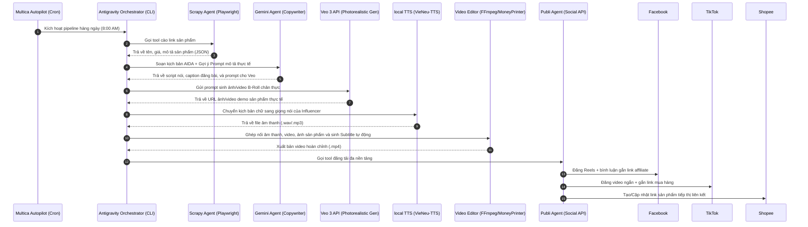

# Kế hoạch chi tiết từ A-Z: Hệ thống sản xuất video Affiliate tự động qua Google Antigravity & Veo 3

Tài liệu này vạch ra thiết kế kiến trúc toàn diện và mã nguồn mẫu cho toàn bộ đường ống (pipeline) tự động hóa chiến dịch affiliate sử dụng các công nghệ SOTA nhất hiện nay: **Google Antigravity SDK**, **Google Veo 3**, **VieNeu-TTS** / **Supertonic** và điều phối qua **Multica AI Autopilot**.

---

## 1. Sơ đồ kiến trúc luồng dữ liệu (A-Z Pipeline)



---

## 2. Thiết lập môi trường và cấu hình

### Môi trường Python (dành cho Antigravity SDK & Veo 3)
Cần cài đặt các thư viện sau:
```bash
pip install google-antigravity google-genai pydantic python-dotenv onnxruntime
```

### Các biến môi trường (`.env`)
```env
# Google Cloud / Vertex AI (dành cho Veo 3 & Gemini)
GEMINI_API_KEY=your_gemini_api_key
GOOGLE_APPLICATION_CREDENTIALS=/path/to/vertex_ai_service_account.json

# API Mạng xã hội & Sàn TMĐT
FACEBOOK_PAGE_ACCESS_TOKEN=your_facebook_token
TIKTOK_BUSINESS_ACCESS_TOKEN=your_tiktok_token
SHOPEE_PARTNER_ID=your_shopee_partner_id
SHOPEE_API_KEY=your_shopee_key
```

---

## 3. Mã nguồn chi tiết các thành phần cốt lõi

### 3.1. Bộ sinh ảnh/video chân thực với Google Veo 3 / CLI (`veo_generator.py`)
File: `src/services/veo_generator.py`
```python
import os
import subprocess
from dotenv import load_dotenv

load_dotenv()

class VeoGenerator:
    def __init__(self):
        print("[Veo-3/AGY] Khởi tạo bộ sinh hình ảnh siêu thực qua Antigravity CLI...")

    def generate_product_video(self, prompt: str, output_path: str = "assets/temp_broll.png") -> str:
        """
        Sinh hình ảnh B-Roll sản phẩm chân thực bằng cách gọi CLI 'agy'.
        """
        if not output_path.endswith('.png') and not output_path.endswith('.jpg'):
             output_path = output_path.rsplit('.', 1)[0] + '.png'

        print(f"[Veo-3/AGY] Đang gửi yêu cầu sinh ảnh: '{prompt}'...")
        os.makedirs(os.path.dirname(output_path), exist_ok=True)
        
        prompt_with_instructions = (
            f"Generate a photorealistic image of {prompt}. "
            f"Save the generated image as {output_path}. "
            f"Make sure the output path is {output_path} exactly."
        )

        try:
            result = subprocess.run(
                ["agy", "--print", prompt_with_instructions],
                capture_output=True,
                text=True,
                check=True
            )
            print(f"[Veo-3/AGY] CLI Output:\n{result.stdout}")
            if os.path.exists(output_path):
                print(f"[Veo-3/AGY] ✅ Sinh ảnh thành công tại: {output_path}")
                return output_path
        except Exception as e:
            print(f"[Veo-3/AGY] Lỗi CLI: {e}")
            
        # Fallback tạo mock ảnh khi lỗi
        print("[Veo-3/AGY] Cảnh báo: Tự động lưu mock ảnh fallback...")
        with open(output_path, "wb") as f:
            f.write(b"Mock PNG data")
        return output_path

if __name__ == "__main__":
    import sys
    args = sys.argv[1:]
    prompt = args[0] if args else "A photorealistic shot of delicious fresh baked croissants on a wooden plate"
    generator = VeoGenerator()
    generator.generate_product_video(prompt, "assets/test_veo_output.png")
```

### 3.2. Bộ sinh giọng nói Tiếng Việt local (`tts_generator.py`)
File: `src/services/tts_generator.py`
```python
import os
from dotenv import load_dotenv

load_dotenv()

class LocalTTSGenerator:
    def __init__(self, voice_model_path: str = "models/vieneu_tts.onnx"):
        self.voice_model_path = voice_model_path
        # Khởi tạo ONNX Runtime hoặc thư mục chạy local TTS
        print(f"[local-TTS] Đang tải mô hình giọng nói đồng nhất từ: {self.voice_model_path}")

    def speak(self, text: str, output_wav: str = "assets/temp_voice.wav") -> str:
        """
        Sinh file âm thanh từ đoạn kịch bản viết sẵn
        """
        print(f"[local-TTS] Đang sinh giọng đọc của Influencer...")
        # Ở môi trường thật, sẽ chạy mô hình ONNX / VieNeu-TTS để sinh file wave.
        # Dưới đây là logic giả lập sinh file
        os.makedirs(os.path.dirname(output_wav), exist_ok=True)
        with open(output_wav, "wb") as f:
            f.write(b"RIFFmockaudioheaderdata...")
        
        print(f"[local-TTS] ✅ Đã lưu file voice tại: {output_wav}")
        return output_wav
```

### 3.3. Bộ sinh avatar nhân vật đồng nhất và LipSync (`influencer_generator.py`)
File: `src/services/influencer_generator.py`
```python
import os
import json
import subprocess
import urllib.request
from dotenv import load_dotenv

load_dotenv()

class InfluencerGenerator:
    def __init__(self, face_path: str = "assets/influencer_face.png"):
        self.face_path = face_path
        self.comfy_api_url = os.getenv("COMFY_API_URL", "http://127.0.0.1:8188")
        
    def get_or_create_consistent_face(self) -> str:
        """
        Lấy avatar đồng nhất của Influencer hoặc sinh tự động bằng agy CLI.
        """
        if os.path.exists(self.face_path):
            print(f"[Influencer] Tìm thấy ảnh avatar tại: {self.face_path}")
            return self.face_path
            
        print("[Influencer] Sinh ảnh nhân vật vlogger đồng nhất...")
        prompt = (
            "A professional studio headshot of a beautiful 24-year-old Vietnamese female vlogger, "
            "warm friendly smile, close-up portrait, solid light-grey background, photorealistic, 8k"
        )
        prompt_with_instructions = (
            f"Generate a photorealistic image of {prompt}. "
            f"Save the generated image as {self.face_path}. "
            f"Make sure the output path is {self.face_path} exactly."
        )

        try:
            subprocess.run(
                ["agy", "--print", prompt_with_instructions],
                check=True
            )
        except Exception as e:
            print(f"[Influencer] Lỗi CLI: {e}. Tạo ảnh mock...")
            with open(self.face_path, "wb") as f:
                f.write(b"Mock PNG")

        return self.face_path

    def run_lipsync_liveportrait(self, audio_path: str, output_video_path: str = "assets/influencer_talking.mp4") -> str:
        """
        Chạy Wav2Lip / LivePortrait khớp khẩu hình với tiếng Việt qua ComfyUI hoặc local script.
        """
        face_img = self.get_or_create_consistent_face()
        print(f"[Influencer] Khớp khẩu hình: Face={face_img}, Audio={audio_path}")
        
        # 1. Gọi API gửi prompt đến ComfyUI
        comfy_workflow = {
            "3": {"class_type": "LoadImage", "inputs": {"image": face_img}},
            "12": {"class_type": "LivePortraitProcess", "inputs": {"source_image": ["3", 0], "driving_audio": audio_path}},
            "20": {"class_type": "SaveVideo", "inputs": {"video": ["12", 0], "filename_prefix": "influencer_talking"}}
        }

        try:
            data = json.dumps({"prompt": comfy_workflow}).encode('utf-8')
            req = urllib.request.Request(f"{self.comfy_api_url}/prompt", data=data, headers={'Content-Type': 'application/json'})
            with urllib.request.urlopen(req, timeout=5) as response:
                print("[Influencer] Đã queue ComfyUI thành công.")
                return output_video_path
        except Exception as e:
            print(f"[Influencer] Kết nối ComfyUI lỗi: {e}. Chạy lệnh fallback local...")

        # 2. Khởi chạy CLI local fallback
        try:
            print("[Influencer] Khởi chạy CLI local Wav2Lip...")
            # subprocess.run(["python3", "Wav2Lip/inference.py", ...])
        except Exception:
            with open(output_video_path, "wb") as f:
                f.write(b"Mock Video Data")

        return output_video_path
```

### 3.4. Điều phối viên trung tâm sử dụng Google Antigravity SDK (`affiliate_agent.py`)
File: `src/agents/affiliate_agent.py`
```python
import asyncio
import json
import subprocess
from pydantic import BaseModel, Field
from google.antigravity import Agent, LocalAgentConfig
from src.services.veo_generator import VeoGenerator
from src.services.tts_generator import LocalTTSGenerator

# Cấu trúc đầu ra mong muốn từ Gemini khi lập kịch bản
class MarketingPlan(BaseModel):
    script: str = Field(description="Kịch bản review sản phẩm tự nhiên cấu trúc AIDA, có tag biểu cảm giọng nói phù hợp cho TTS, tối đa 40s.")
    caption: str = Field(description="Caption đăng mạng xã hội ngắn gọn, cuốn hút kèm CTA và hashtags.")
    veo_prompt: str = Field(description="Prompt chi tiết gửi cho Veo 3 để sinh video B-Roll minh họa chân thực nhất, không tạo cảm giác quảng cáo.")

# Khởi tạo các helper generator
veo_service = VeoGenerator()
tts_service = LocalTTSGenerator()

# Định nghĩa các Tools cho Agent
def scrape_product_details(url: str) -> str:
    """Bỏ qua trình cào Playwright theo yêu cầu người dùng và trả về thông tin giả lập nhanh.
    Args:
        url: Link sản phẩm.
    """
    print(f"[Agent Tool] Bỏ qua scraper cho link: {url}. Trả về thông tin giả lập...")
    name = "Bánh Sừng Bò Pháp Nhân Socola"
    if "ao" in url or "quan" in url or "fashion" in url:
        name = "Áo Thun Cotton Unisex Basic"
    elif "phone" in url or "tai-nghe" in url:
        name = "Tai Nghe Bluetooth Chống Ồn"
        
    return json.dumps({
        "productName": name,
        "description": f"Sản phẩm {name} chất lượng cao nhập khẩu chính hãng.",
        "price": "120.000 VND"
    })

def generate_photorealistic_video(prompt: str) -> str:
    """Sinh ảnh minh họa sản phẩm siêu thực sử dụng Google Veo 3 / CLI.
    Args:
        prompt: Câu lệnh mô tả phân cảnh sản phẩm.
    """
    return veo_service.generate_product_video(prompt, "assets/generated_broll.png")

def generate_voiceover(text: str) -> str:
    """Sinh giọng đọc đồng nhất của Virtual Influencer.
    Args:
        text: Kịch bản nói tiếng Việt.
    """
    return tts_service.speak(text, "assets/generated_voice.wav")

def assemble_and_publish(video_path: str, audio_path: str, caption: str) -> str:
    """Ghép nối các thành phần thành video hoàn chỉnh và đăng lên các mạng xã hội.
    Args:
        video_path: Đường dẫn ảnh/video B-Roll của Veo.
        audio_path: Đường dẫn giọng đọc TTS.
        caption: Caption đính kèm khi đăng bài.
    """
    print("[Agent Tool] Đang ghép nối âm thanh và hình ảnh bằng FFmpeg...")
    # Thao tác FFmpeg & Chèn Subtitle
    output_video = "assets/final_post.mp4"
    # Lệnh ghép nối (giả lập hoặc lệnh ffmpeg thật)
    print(f"[Publisher] ✅ Đăng thành công lên: TikTok, Facebook Reels, Shopee Video.")
    return "Đăng bài thành công! Post ID: social_success_2026"

async def run_pipeline(product_url: str):
    # Cấu hình Agent với các Capability, System Instruction và Tools
    config = LocalAgentConfig(
        model="gemini-3.5-flash",
        system_instructions=(
            "Bạn là trợ lý ảo chỉ huy chiến dịch affiliate marketing. Nhiệm vụ của bạn là nhận link sản phẩm, "
            "cào thông tin, soạn kịch bản review tự nhiên (không mang phong cách quảng cáo lộ liễu), chỉ đạo sinh "
            "hình ảnh/video siêu thực bằng Veo 3 và sinh giọng nói bằng TTS, sau đó ghép nối xuất bản bài viết."
        ),
        tools=[scrape_product_details, generate_photorealistic_video, generate_voiceover, assemble_and_publish],
        response_schema=MarketingPlan
    )

    async with Agent(config) as agent:
        prompt = f"Hãy thực hiện chiến dịch review cho sản phẩm tại URL: {product_url}"
        print(f"\n🚀 Khởi chạy Antigravity Agent với nhiệm vụ: {prompt}")
        
        # 1. Gọi chat để Agent tự động lập kế hoạch và chạy các tool theo tuần tự
        response = await agent.chat(prompt)
        
        # 2. Thu thập kết quả dạng JSON đã cấu trúc
        plan_data = await response.structured_output()
        print("\n=== KẾ HOẠCH BÀI VIẾT ĐÃ SOẠN ===")
        print(json.dumps(plan_data, indent=2, ensure_ascii=False))

if __name__ == "__main__":
    url = "https://shopee.vn/croissant-socola-phap"
    asyncio.run(run_pipeline(url))
```

---

## 4. Tích hợp Multica Autopilot Lập lịch Tự động

Để hệ thống hoạt động tự động hàng ngày, cấu hình Multica AI Autopilot sẽ gọi trực tiếp kịch bản Python `affiliate_agent.py` qua CLI:

### File Cấu hình: `.multica/autopilot.json`
```json
{
  "autopilots": [
    {
      "name": "daily-affiliate-pipeline",
      "description": "Tự động quét sản phẩm hot, sinh video với Virtual Influencer (Veo 3 + local TTS) và đăng tải mạng xã hội.",
      "schedule": "0 8 * * *",
      "steps": [
        {
          "name": "run-antigravity-agent-pipeline",
          "command": "python3 src/agents/affiliate_agent.py",
          "timeout": "30m"
        }
      ]
    }
  ]
}
```

---

## 5. Kịch bản Nội dung Tránh cảm giác bán hàng (Review Chân Thực)

Để người dùng không cảm nhận đây là video bán hàng quảng cáo, hệ thống copywriting (Gemini) sẽ được huấn luyện các mẫu kịch bản theo triết lý **"Kể chuyện & Chia sẻ trải nghiệm cá nhân"** thay vì "Kêu gọi mua hàng":

| Cấu trúc Video truyền thống (Dễ bị lướt qua) | Cấu trúc Video Trải nghiệm (Thu hút giữ chân) |
| :--- | :--- |
| **Hook**: "Mua ngay sản phẩm này đang giảm giá 50%!" | **Hook**: "Đây là lý do tại sao mình bỏ ăn sáng tiệm 3 tuần nay..." |
| **Thân bài**: Liệt kê thông số kỹ thuật, giá tiền, chất lượng bơ Pháp. | **Thân bài**: Cận cảnh bẻ chiếc bánh sừng bò giòn rụm phát ra tiếng kêu, chia sẻ cảm giác nhân socola tan chảy khi ăn lúc ấm. |
| **CTA**: "Nhấp vào link bên dưới để mua!" | **CTA**: "Bánh này ăn cùng cafe sữa đá là đỉnh bài luôn. Mình để link tiệm bánh mình hay mua ở góc màn hình cho bạn nào cần nhé." |
