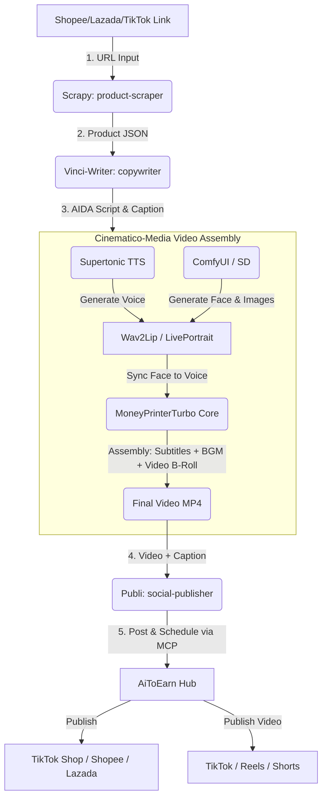

# Research and Architecture Proposal: AI-Powered Affiliate Automation

This document presents the research findings for three open-source repositories and proposes a cohesive architectural solution to achieve the project's goal: **building a fully automated pipeline that generates and publishes review videos with a consistent Virtual Influencer for affiliate marketing**.

---

## 1. Analysis of the Open-Source Repositories

### 🎥 MoneyPrinterTurbo ([harry0703/MoneyPrinterTurbo](https://github.com/harry0703/MoneyPrinterTurbo))
* **Primary Function**: Automates short-video (TikTok/Reels/Shorts) generation using LLMs.
* **Core Capabilities**:
  * Write scripts automatically or ingest custom ones.
  * Search and download background videos/assets.
  * Synthesize voiceovers and auto-generate styled subtitles.
  * Combine audio, video tracks, background music (BGM), and subtitles into a cohesive 9:16 or 16:9 MP4 file.
* **Role in our System**: Serves as the **Video Assembly Engine**. It replaces manual editing by taking the script from `copywriter` and the voice from TTS, downloading relevant background b-roll, overlaying subtitles, and packaging the final video.

---

### 🗣️ Supertonic ([supertone-inc/supertonic](https://github.com/supertone-inc/supertonic))
* **Primary Function**: Ultra-fast, lightweight, on-device (local) Text-to-Speech (TTS) engine.
* **Core Capabilities**:
  * Runs completely locally using ONNX Runtime with minimal computational overhead.
  * Supports 31 languages (excellent performance for Vietnamese).
  * Supports **Expression Tags** (e.g., `<laugh>`, `<breath>`, `<sigh>`) to produce human-like, expressive speech.
  * Compact footprint (66M–99M parameters), enabling execution on low-cost devices or alongside GPU workloads.
* **Role in our System**: Serves as the **Consistent Voice Generator**. It defines the unified, signature voice of the Virtual Influencer. Running locally saves API costs, while expression tags ensure the review videos sound natural and highly engaging.

---

### 🌐 AiToEarn ([yikart/AiToEarn](https://github.com/yikart/AiToEarn))
* **Primary Function**: AI-powered social media management and marketing automation platform.
* **Core Capabilities**:
  * Automated cross-platform posting (TikTok, YouTube, Instagram, Facebook, X, etc.).
  * Scheduling, comment monitoring, and sentiment analysis for replies.
  * **Model Context Protocol (MCP)** server support, allowing direct integration into agentic workflows.
  * Built-in Web App dashboard for centralized management.
* **Role in our System**: Serves as the **Publishing & Console Layer**. It replaces the custom headless publishing code, handles account sessions/OAuth securely, publishes scheduled videos, and acts as the WebApp for the campaign.

---

## 2. Integrated Solution Architecture

To build a robust, scalable system matching the requirements, we propose the following multi-agent architecture orchestrated by **Multica Autopilot**:

### Flow Breakdown:
1. **Scraping**: `product-scraper` runs Playwright to extract structured details (title, description, price, ratings, images).
2. **Copywriting**: `copywriter` uses Gemini API to create an AIDA script with voice directions (including `<breath>` or `<sigh>` tags for Supertonic).
3. **Voice**: `media-producer` invokes the local **Supertonic** ONNX instance to generate the Vietnamese voiceover.
4. **Visuals & LipSync**: `media-producer` runs ComfyUI to generate/render the Virtual Influencer character, then matches mouth movements to the voiceover using Wav2Lip or LivePortrait.
5. **Assembly**: **MoneyPrinterTurbo** core takes the lipsynced influencer track, overlays product images/videos as b-roll overlays, adds background music, and burns in high-contrast subtitles.
6. **Publishing**: `social-publisher` uses the **AiToEarn** API/MCP connection to schedule and publish the video, inserting affiliate purchase links in the comments/description.

---

## 3. Implementation Plan & Actionable Roadmap

> [!TIP]
> We can implement this in three distinct phases, starting from simple command integrations and moving towards a unified web dashboard.

### Phase 1: local TTS & Copywriting Upgrade (Immediate)
* **Goal**: Enable consistent voice and expressive script writing.
* **Tasks**:
  1. Update `copywriter.ts` to instruct Gemini to include emotional/breath tags suitable for Supertonic.
  2. Implement a local node-based runner for `supertonic` inside `media_generator.ts` (using `supertonic` ONNX bindings) to generate the actual `.wav` or `.mp3` voiceover file locally instead of mock assets.

### Phase 2: Automated Video Assembly (Medium-term)
* **Goal**: Remove mock video exports and build real videos automatically.
* **Tasks**:
  1. Deploy `MoneyPrinterTurbo` core on the Alibaba Cloud ECS GPU node.
  2. Set up ComfyUI pipelines for the Virtual Influencer image/video generation.
  3. Integrate the assembly step in `media_generator.ts` to call MoneyPrinterTurbo CLI/API to combine voice, video, subtitles, and music.

### Phase 3: Centralized Publishing & WebApp Management (Long-term)
* **Goal**: Provide a clean UI dashboard and robust multi-channel posting.
* **Tasks**:
  1. Spin up an `AiToEarn` Docker instance.
  2. Map the existing `social_publisher.ts` to forward finished videos and captions to the `AiToEarn` publishing APIs.
  3. Use the AiToEarn dashboard to manage affiliate credentials and schedule/track postings.

---

## 4. Newly Researched Related Repositories (GitHub Trending & SOTA)

We have scanned GitHub trending and state-of-the-art (SOTA) repositories to find tools directly relevant to each stage of our **Affiliate Automation Pipeline**:

### A. Vietnamese Text-to-Speech (TTS) & Voice Cloning
To establish the **consistent and expressive voice** of our Virtual Influencer:
1. **[VieNeu-TTS](https://github.com/pnnbao97/VieNeu-TTS)**: A high-performance TTS engine optimized for natural Vietnamese speech and English code-switching. It supports zero-shot voice cloning (using only 3-5 seconds of sample audio) and runs efficiently on CPU/GPU via ONNX.
2. **[F5-TTS-Vietnamese](https://github.com/nguyenthienhy/F5-TTS-Vietnamese)**: A fine-tuned version of the popular F5-TTS architecture trained on 1,000+ hours of Vietnamese speech. Ideal if we need extremely high-fidelity local voice cloning.

### B. Portrait Animation & Lipsync (Digital Human)
To animate the face and mouth of our Virtual Influencer character:
1. **[LivePortrait](https://github.com/KlingAIResearch/LivePortrait)**: A state-of-the-art facial reenactment model. It takes a static portrait image of our influencer and a driving video (or motion data) to animate realistic facial expressions, eye blinks, and head poses. Highly popular in the ComfyUI ecosystem.
2. **[Wav2Lip](https://github.com/Rudrabha/Wav2Lip)**: The gold standard for audio-driven lip-syncing. It modifies the mouth movements of any video of our influencer to perfectly sync with the Vietnamese audio generated by the TTS engine.

### C. Multi-Store E-Commerce Integration (Product Syncing)
To automate the creation of product details and listings on sales channels:
1. **[codustry/marketeer](https://github.com/codustry/marketeer)**: An open-source integration layer designed to normalize Shopee, Lazada, and TikTok Shop APIs into a single consistent interface. It helps synchronize product catalogs and inventory.
2. **[shopee-tiktok-lazada-api](https://github.com/phamkhanhminhman97/shopee-tiktok-lazada-api)**: A TypeScript-based Open API client/wrapper that integrates all three major Southeast Asian marketplaces, making API requests and auth flows (OAuth) simpler.

### D. Advanced AI Video Generators (B-Roll Creation)
If the video needs fully custom generated product demo scenes (rather than stock b-roll):
1. **[Open-Sora](https://github.com/hpcaitech/Open-Sora)**: An open-source text-to-video model.
2. **[Wan2.1 (Wan-Video)](https://github.com/Wan-Video/Wan2.1)**: A state-of-the-art video generation model capable of running on consumer-grade GPUs (RTX 4090), excellent for custom product animations.

